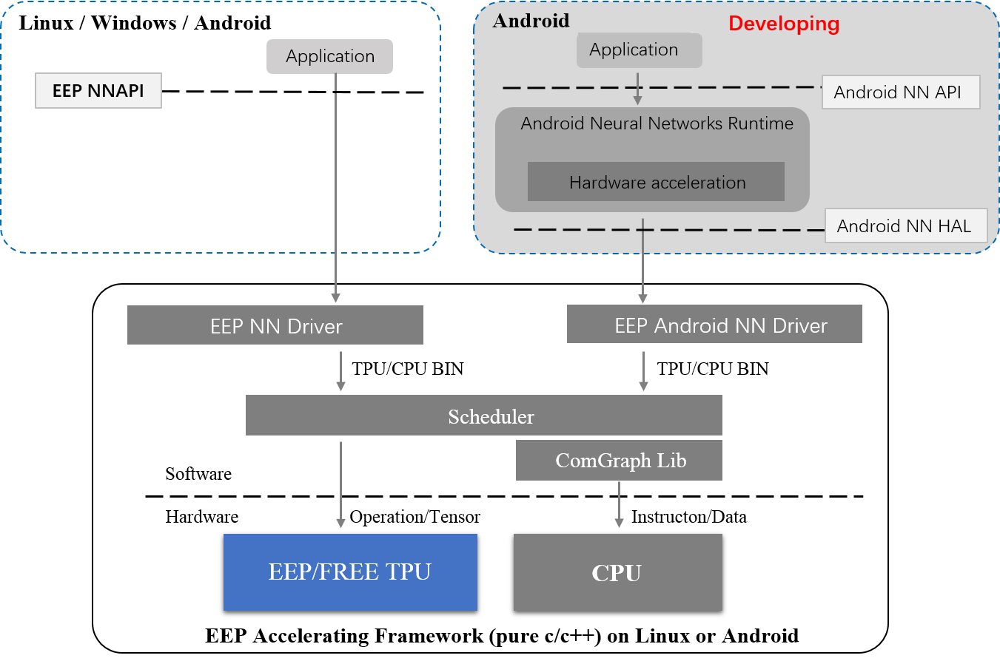

# FREE TPU for FPGA
***Free TPU*** is the free version of a commercial TPU design for Deep Learning EDGE Inference, which can deploy at any FPGA device including Xilinx Zynq-7020 or Kintex7-160T (both good choices for production). Actually, not just only a TPU logic design, the ***Free TPU*** also include the EEP Accelerating Framework ***supporting all caffe layers***, which can run at any CPU (such as the ARM A9 of Zynq-7020 or INTEL/AMD). TPU and CPU co-work with each other under the schedule of the Deep Learning Inference Framework (any order of alternation). Then, you can do anything you want with *FREE!* (We release the ***Free TPU*** with MIT LICENSE). After a comprehensive pressure testing, we are finally ready to formally release the FREE-TPU with commercial quality. Enjoy it!<br>More details, please visit https://www.embedeep.com
<div align=center><br>FPGA demo for FREE-TPU
</div>

## System Structure
<div align=center><br>Application environment of FREE-TPU
</div> 

## HARD IP CORE
||FREE-TPU|EEP-TPU-FS020|EEP-TPU-FS035-152|EEP-TPU-FS035-272|EEP-TPU-FS035-528|EEP-TPU-FS035-1040
:---:|:---:|:---: |:---:|:---:|:---:|:---:
Binding Hardware|No|EEP-TPU-M020|EEP-TPU-EV-S Kits|EEP-TPU-EV-S Kits|EEP-TPU-EV-S Kits|EEP-TPU-EV-S Kits
Target Device|Xilinx xc7z020-1|Xilinx xc7z020-1|Xilinx xc7z035-2|Xilinx xc7z035-2|Xilinx xc7z035-2|Xilinx xc7z035-2
FPGA utilization|LUT: 62.96% <br>FF: 56.08% <br>BRAM: 80.00% <br>DSP: 73.18%|LUT: 66.12% <br>FF: 56.92% <br>BRAM: 80.00% <br>DSP: 73.18%|LUT: 26.54% <br>FF: 23.34% <br>BRAM: 37.40% <br>DSP: 17.89%|LUT: 26.52% <br>FF: 23.35% <br>BRAM: 37.40% <br>DSP: 31.89%|LUT: 28.89% <br>FF: 24.02% <br>BRAM: 37.40% <br>DSP: 59.67%|LUT: 69.85% <br>FF: 40.90% <br>BRAM: 40.60% <br>DSP: 100%
TPU Layer set|LS-V1.0|LS-V2.0|LS-V2.0|LS-V2.0|LS-V2.0|LS-V2.0
FP16 MACs|152|152|152|272|528|1040
Frequency|100 MHz|100 MHz|200 MHz|200MHZ|200MHZ|200MHZ
AXI port|1|1|2|2|2|2
Off-chip DDR bandwidth|12.8 Gbps (Shared)|12.8 Gbps (Shared)|51.2 Gbps (Dedicated)|51.2 Gbps (Dedicated)|51.2 Gbps (Dedicated)|51.2 Gbps (Dedicated)
On-chip Memory|256 KByte|256 KByte|512 KByte|512KByte|512KByte|512KByte
OS|Linux|Linux|Linux|Linux|Linux|Linux
Compiler|NO|YES|YES|YES|YES|YES
EEP Accelerating Framework|YES|YES|YES|YES|YES|YES
EEP NNAPI|YES|YES|YES|YES|YES|YES
Android NNAPI|NO|*Release in future*|*Release in future*|*Release in future*|*Release in future*|*Release in future*
License|MIT|Commercial|Commercial|Commercial|Commercial|Commercial


From the view of users, *Free-TPU* and *EEP-TPU* has the same functionality, but with different inference time. If the inference time of *Free-TPU* is NOT good enough for your applications, you can contact us in any time. We will be happy to share our experience about algorithm, software or hardware with you.
### TIPS
+ We plan to release two implementations targeted to two different FPGA chip: Xilinx Zynq-7020 and Xilinx Kintex7-160T. For now, the implementation for Xilinx Zynq-7020 has been released.
+ For FREE-TPU users who do not have a FPGA board with Xilinx Zynq-7020 chip, you are free to choose a FPGA board according to the supporting board lists declared at the Appendix section of [Free-TPU-OS](https://github.com/embedeep/Free-TPU-OS), or you can choose our official $99 EEP-TPU-M020 board.
+ For users who want to try any other NN network, you can send the corresponding **.prototxt and **.caffemodel to us for BIN generation, or, our official $99 EEP-TPU-M020 board that including a EEP-TPU-Compiler software is ready for you. 
+ For advanced users who intend to modify the logic design in FPGA, including add new IP in PL side of Zynq (such as a video DMA), use PCIe based hardware scheme or configure the EEP-TPU with different params, we are providing three kinds of $999 EEP-TPU-EV-S/A/H Kits that including one Soft IP which CAN be merged into user design through encrypted code.
+ For advanced users who intend to modify the hardware but had limited experience, we are providing the $1999/year technical support that including the EEP-TPU hardware customization service.
+ Please visit https://www.embedeep.com for more info, which including the technical detail of *FREE TPU*, the definition of *Layer set*, and the product of EMBEDEEP which could be helpful for your research and development.

## Benchmark 
||667MHZ ARM A9<br>with NEON|FREE-TPU<br>on EEP-TPU-M020|EEP-TPU-FS020<br>on EEP-TPU-M020| EEP-TPU-FS035-152<br>on EEP-TPU-EV-S|EEP-TPU-FS035-272<br>on EEP-TPU-EV-S|EEP-TPU-FS035-528<br>on EEP-TPU-EV-S
:---:|:---:|:---: |:---: |:---: |:---:|:---:
FP16 computing resource|NA|30.4 GOPS|30.4 GOPS|60.8 GOPS|108.8 GOPS|211.2 GOPS
on-chip memory|NA|256 KByte|256 KByte|512 KByte|512 KByte|2.5 Mbyte
off-chip DDR bandwidth|33 Gbps<br>(Shared)|12.8 Gbps<br>(Shared)|12.8 Gbps<br>(Shared)|51.2 Gbps<br>(Dedicated)|51.2 Gbps<br>(Dedicated)|51.2 Gbps<br>(Dedicated)
[lenet-5](Deep_Learning_Algorithm/models/)| 4.6ms | 1.359ms | 1.345ms |   0.703ms | 0.657ms | 0.619ms |
[Mobilenet-V1](Deep_Learning_Algorithm/models/)| 768ms | 74.754ms | 74.739ms |  40.731ms | 30.196ms | 25.633ms |
[Mobilenet-V1 with mergeBN](Deep_Learning_Algorithm/models/)| 679.6ms | 66.571ms | 66.564ms |  34.391ms | 23.883ms | 19.317ms |
[Mobilenet-V2](Deep_Learning_Algorithm/models/)| 810ms | 83.896ms | 83.867ms |  48.468ms | 41.337ms | 38.470ms |
[Mobilenet-V2 with mergeBN](Deep_Learning_Algorithm/models/)| 660ms | 69.540ms | 69.541ms |  37.290ms | 30.153ms | 27.255ms |
[Squeezenet-v1.1](Deep_Learning_Algorithm/models/)| 416.4ms | 46.216ms | 46.235ms |  25.356ms | 17.890ms | 14.895ms |
[Resnet-50 with mergeBN](Deep_Learning_Algorithm/models)| 4753ms | 367.696ms | 367.674ms | 188.413ms | 115.299ms | 82.900ms |
[Inception-V3](Deep_Learning_Algorithm/models/)| 21493.7ms | 516.362ms | 516.539ms | 265.305ms | 154.225ms | 102.281ms |
[Mobilenet-YOLOV3](Deep_Learning_Algorithm/models/)| 2058.6ms | 207.849ms | 179.422ms |  91.311ms | 59.827ms | 44.578ms |
[ICNet](Deep_Learning_Algorithm/models/)| 3347.8ms | 1342.354ms | 228.263ms | 122.257ms | 83.348ms | 64.173ms |
+ FREE-TPU and EEP-TPU all use FP16 model to get the same accuracy with the original FP32 model.
+ The inference time includes the time to fetch an image from HOST memory, computing, and export the result to HOST memory.

## Software Development Kits 
***Free TPU SDK*** imports the trained model from CAFFE (**.prototxt and **.caffemodel) directly to generate the BIN file. No further re-training or fine-tuning necessary. We DO NOT release the SDK for FREE TPU yet. Instead, we provide the BIN file of typical NN network for you. For users who want to try other NN network, you can send the corresponding **.prototxt and **.caffemodel to us for BIN generation.

## EEP NNAPI
By using ***EEP NNAPI***, users can develop your own APPs with TPU inference capability. <br>We will release the ***EEP NNAPI*** In the next coming update.

## Development Resource 
### FPGA BIN
FPGA device|BIN|Version
:---:|:---:|:---:
Xilinx Zynq-7020|[boot.BIN](https://github.com/embedeep/Free-TPU-OS/tree/master/BOOTbin)|v0.6.0-r28-p16

FREE TPU DO NOT use any PIN from PL side of Zynq chip. Hence, in general, you can use any board including a Xilinx Zynq-7000 series chip to run the FREE TPU. If you are using other FPGA chips, please let us know through issues, we are happy to release corresponding BIT file if possible.
### Run steps
1. Clone this repository
```
git clone https://github.com/embedeep/Free-TPU
```

2. Launch Linux OS (please refer to [Free-TPU-OS](https://github.com/embedeep/Free-TPU-OS)).

3. Connect the system through SSH or UART, and execute the demo application as follow (more detail about demo application, please refer to [Runtime_Software](/Runtime_Software/Readme.md) )
```
eepdemo_arm  --bin BIN_file --image IMG_file
```

4. If everything right, you will see the result through terminal or saved image. Enjoy!

## License
MIT LICENSE

## Contact
Questions can email us or be left as issues in the repository, we will be happy to answer them.
## Contributors 
Luo (luohy@embedeep.com) <br>
Zhou (zhouzx@embedeep.com) <br>
He (herh@embedeep.com)
